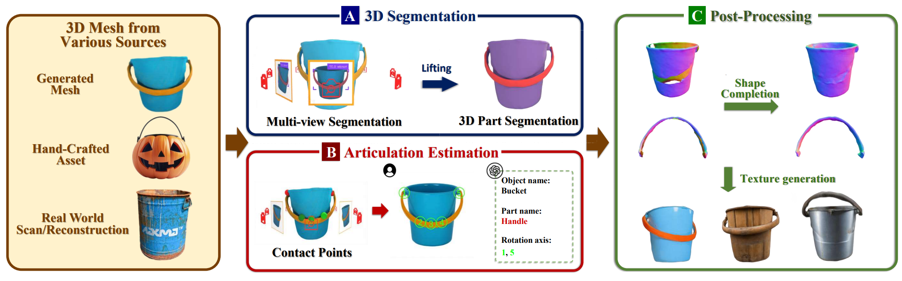

<p align="center">
  <h1 align="center">Articulate Anymesh: Open-vocabulary 3D Articulated Objects Modeling</h1>
  <p align="center">
    arXiv 2025
  </p>
  <p align="center">
    <a href="https://arxiv.org/abs/2502.02590">
      
    </a>
    <a href='https://articulateanymesh.github.io/' style='padding-left: 0.5rem;'>
      
    </a>
  </p>
</p>

we propose Articulate AnyMesh, an automated framework that is able to convert any rigid 3D mesh into its articulated counterpart in an open-vocabulary manner.

<p align="center">
    
</p>

## Installation
#### Install Genesis

```bash
# We tested our code on torch 2.3.1, CUDA 11.8
pip install torch==2.3.1 torchvision==0.18.1 torchaudio==2.3.1 --index-url https://download.pytorch.org/whl/cu118

pip install git+https://github.com/Genesis-Embodied-AI/Genesis.git
```
If you would like to enable **LuisaRender** for ray-tracing-based rendering, follow the optional installation instructions [here](https://genesis-world.readthedocs.io/en/latest/user_guide/overview/installation.html#optional-ray-tracing-renderer)

#### 2. Install Dependencies for PartSLIP
```bash
pip install "git+https://github.com/facebookresearch/pytorch3d.git"

CONDAENV=YOUR_CONDA_ENVIRONMENT_LOCATION
cd partition/cut-pursuit
mkdir build
cd build
cmake .. -DPYTHON_LIBRARY=$CONDAENV/lib/libpython3.9.so -DPYTHON_INCLUDE_DIR=$CONDAENV/include/python3.9 -DBOOST_INCLUDEDIR=$CONDAENV/include -DEIGEN3_INCLUDE_DIR=$CONDAENV/include/eigen3
make

pip install git+https://github.com/facebookresearch/segment-anything.git
```

#### 3. Install Other Dependencies

```bash
pip install scikit-learn open3d pyyaml pycocotools supervision openai
```

By default, we use **Set-of-Mark (SoM)** visual prompting for segmentation. If you would like to try alternative methods such as [Grounding-DINO](https://github.com/paulguerrero/lang-sam) or [DINO-X](https://github.com/IDEA-Research/DINO-X-API), you can install them by following the respective repositories and set the "seg_method" argument accordingly in the config file (note: performance may be weaker).

## Usage Example

1. Modify the config path to your desired object directory, e.g., `data_dir/object_name`.
2. Optionally, specify movable parts in the configuration YAML.

Run the following command:
```bash
# We use the GPT API through the Microsoft Azure platform.
export GPT_ENDPOINT=YOUR_GPT4O_ENDPOINT
export API_KEY=YOUR_AZURE_API_KEY

python run.py --config ./configs/fridge.yaml
```

For geometry & texture post-processing, we use [Holopart](https://github.com/VAST-AI-Research/HoloPart) and [Meshy](https://www.meshy.ai/).

## Acknowledgement
Here we would like to thank the following resources for their great work:
[PartSLIP2](https://github.com/zyc00/PartSLIP2), [Set of Mark visual prompting](https://github.com/microsoft/SoM) , [Grounding-DINO](https://github.com/IDEA-Research/GroundingDINO), [LANGSAM](https://github.com/paulguerrero/lang-sam), [DINOX](https://github.com/IDEA-Research/DINO-X-API), [Genesis](https://github.com/Genesis-Embodied-AI/Genesis).

We also thank Zlat and Artem P for providing the high-quality 3D models we used in our codebase:  [fridge](https://sketchfab.com/3d-models/retro-fridge-f83cfd9e3edf4b4abab5ca14b0b28ec5) and [toaster](https://sketchfab.com/3d-models/toaster-0dd620043178479db6752ab103b1e04e).


## Citation

If you find this codebase/paper useful for your research, please consider citing:

```bibtex
@article{qiu2025articulate,
    title={Articulate AnyMesh: Open-vocabulary 3D Articulated Objects Modeling}, 
    author={Qiu, Xiaowen and Yang, Jincheng and Wang, Yian and Chen, Zhehuan and Wang, Yufei and Wang, Tsun-Hsuan and Xian, Zhou and Gan, Chuang},
    journal={arXiv preprint arXiv:2502.02590}, 
    year={2025} 
}
```
